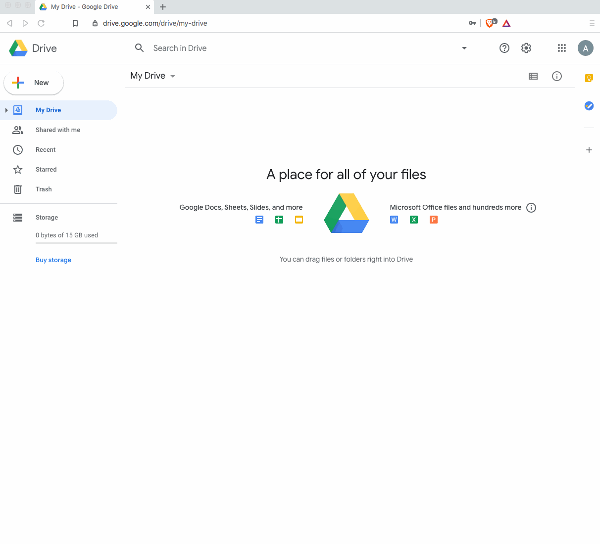

# Workshops for STLinATL

[STLinATL](https://stlinatl.com/) at Woodward Academy, August 3-4, 2020

## Aaron Titus

## Google Colaboratory

To run notebooks, you will need a Google account. You may need to install the Google Colaboratory (colab) app as shown below.

## Workshop 1: Integrating computational modeling into applied math and science

Modeling is a significant component of contemporary applied math and science. Computers allow students to model complex phenomena, explore relationships, and make predictions with no previous coding experience. Integrating computational modeling with the traditional algebraic (i.e. analytic) curriculum - of which we are already quite familiar - allows students to explore more complex and relevant problems without sacrificing the traditional learning objectives.  In this hands-on workshop, you will use Python to explore system dynamics models in math and science, including the spread of infectious disease, financial forecasting, climate models, and others. No previous coding experience is required.
